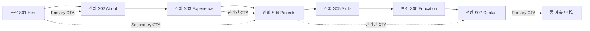

# 정보 구조도(IA) · 와이어프레임 설계서

> **문서 목적**: [content.md](./content.md) 콘텐츠 인벤토리를 기반으로 1인 개발자(콘텐츠 기획자) 포트폴리오의 페이지 위계, 스크롤 순서, 콘텐츠 매핑, 반응형 레이아웃, 사용자 동선을 정의한다.  
> **기준일**: 2026-06-02  
> **관련 문서**: [content.md](./content.md), [design-system.md](./design-system.md), [tech-stack.md](./tech-stack.md)  
> **구현 스냅샷**: M1 완료 — 토큰·`src/content/`·스킵 링크; 섹션 UI는 M2+에서 `siteContent` 연동

---

## 0. 설계 전제

| 항목 | 결정 |
|------|------|
| **페이지 모델** | 단일 페이지(SPA) + 앵커 네비게이션 |
| **페르소나** | 채용 담당자, 1인 사업자·브랜드 담당자(협업·의뢰 검토) |
| **핵심 메시지** | 비영리·콘텐츠 실험 경험 → 스토리텔링·성과 기반 콘텐츠 기획 역량 |
| **분기점** | Mobile `<768px` · Tablet `768–1023px` · Desktop `≥1024px` (컨테이너 max 1280px, gutter 24px) |

---

## 1. 사이트맵 (페이지/섹션 위계)

```
포트폴리오 (Single Page)
├── Global
│   ├── G-01 Top Navigation (앵커 링크)
│   └── G-02 Footer (저작권 · 보조 링크 · SNS)
│
└── Main (스크롤 섹션)
    ├── S01 Hero (#hero)
    ├── S02 About (#about)
    ├── S03 Experience (#experience)
    ├── S04 Projects (#projects)
    ├── S05 Skills (#skills)
    ├── S06 Education (#education)
    └── S07 Contact (#contact)
```

**네비게이션 앵커 (G-01)**

| 라벨 | 앵커 | 대상 섹션 |
|------|------|-----------|
| About | `#about` | S02 |
| Experience | `#experience` | S03 |
| Projects | `#projects` | S04 |
| Skills | `#skills` | S05 |
| Contact | `#contact` | S07 |

> Education(S06)은 신뢰 보조 정보로 스크롤 흐름에만 포함하고, 상단 네비에는 생략 가능(푸터 또는 About 내 링크로 대체).

---

## 2. 섹션 스크롤 순서 · 목적 · 콘텐츠 ID 매핑

### 2.1 스크롤 순서 요약표

| 순서 | 섹션 ID | 섹션명 | 사용자가 얻는 것 (목적) | 주요 콘텐츠 ID |
|:----:|---------|--------|-------------------------|----------------|
| 1 | S01 | Hero | 3초 안에 **누구·무엇을 하는 사람**인지 파악 | C-HERO-01 ~ C-HERO-04 ※ |
| 2 | S02 | About | **가치관·배경 스토리**로 인간적 신뢰 형성 | C-ABOUT-01 ~ C-ABOUT-03 |
| 3 | S03 | Experience | **문제→해결→결과** 구조로 실무·임팩트 검증 | C-EXP-01, C-EXP-02, C-EXP-03 |
| 4 | S04 | Projects | **자기주도 실험·정량 성과**로 기획 역량 증명 | C-PROJECT-01, C-PROJECT-02, C-PROJECT-03 |
| 5 | S05 | Skills | **역량 범주**를 빠르게 스캔·매칭 | C-SKILL-01 ~ C-SKILL-04 |
| 6 | S06 | Education | **학력·성적**으로 기본 신뢰 보완 | C-EDU-01 ~ C-EDU-05 |
| 7 | S07 | Contact | **다음 행동(문의·협업)** 으로 전환 | C-CONTACT-01 ~ C-CONTACT-04 ※ |

※ `C-HERO-*`, `C-CONTACT-*`는 인벤토리에 미정의 항목으로, 구현 시 카피·폼 필드를 본 문서 §4·§6에 따라 신규 ID를 부여한다.

### 2.2 섹션별 콘텐츠 ID 상세 매핑

#### S01 Hero

| UI 블록 | 콘텐츠 ID | 내용(권장) | 출처 |
|---------|-----------|-----------|------|
| Eyebrow 라벨 | C-HERO-01 | `CONTENT STRATEGIST` 등 역할 태그 | 신규 |
| H1 타이틀 | C-HERO-02 | 이름 + 한 줄 포지셔닝 | C-ABOUT-01 요약 파생 |
| 서브카피 | C-HERO-03 | 콘텐츠로 사람의 이야기를 연결한다는 핵심 문장 | C-ABOUT-01 |
| KPI 스트립 (4칸) | C-HERO-04a~d | 예: `5+ yrs NGO` · `855K views` · `190 posts` · `Seoul` | C-EXP·C-PROJECT·C-ABOUT 파생 |

#### S02 About

| UI 블록 | 콘텐츠 ID | 내용 | 출처 |
|---------|-----------|------|------|
| 섹션 제목 | C-ABOUT-00 | About / 소개 | 신규(라벨) |
| 단락 1 | C-ABOUT-01 | 자기소개 1문단 (콘텐츠 기획자 정의) | docscontent About |
| 단락 2 | C-ABOUT-02 | 비영리 5년+ · 브랜딩·SNS·SEO 실험 | docscontent About |
| 단락 3 | C-ABOUT-03 | 현재 관심사 (1인 사업자·브랜드 스토리) | docscontent About |

#### S03 Experience

| UI 블록 | 콘텐츠 ID | 구조 |
|---------|-----------|------|
| 카드 1 | **C-EXP-01** | 제목 · 기간 · Problem · Solution(불릿) · Result(불릿) |
| 카드 2 | **C-EXP-02** | 동일 |
| 카드 3 | **C-EXP-03** | 동일 |

#### S04 Projects

| UI 블록 | 콘텐츠 ID | 구조 | 비고 |
|---------|-----------|------|------|
| 카드 1 | **C-PROJECT-01** | Problem · Solution · Result(수치 강조) | 릴스 성장 |
| 카드 2 | **C-PROJECT-02** | 동일 | Livrhyco · 론칭 미진행 주석 |
| 카드 3 | **C-PROJECT-03** | 동일 | SEO 블로그 |

| UI 블록 | 콘텐츠 ID | 내용 |
|---------|-----------|------|
| 주석/디스클레이머 | C-PROJECT-02-NOTE | ※ 실제 브랜드 론칭은 진행되지 않음 |

#### S05 Skills

| UI 블록 | 콘텐츠 ID | 카테고리 |
|---------|-----------|----------|
| 그룹 1 | **C-SKILL-01** | 콘텐츠 전략 (4항목) |
| 그룹 2 | **C-SKILL-02** | SNS 마케팅 (4항목) |
| 그룹 3 | **C-SKILL-03** | 브랜딩 (4항목) |
| 그룹 4 | **C-SKILL-04** | 강점 기반 역량 (Clifton 테마 4종) |

#### S06 Education

| UI 블록 | 콘텐츠 ID | 필드 |
|---------|-----------|------|
| 학력 카드/테이블 행 | **C-EDU-01** | 학교: 청주대학교 |
| | **C-EDU-02** | 전공: 법학과 |
| | **C-EDU-03** | 학위: 학사 |
| | **C-EDU-04** | 재학: 2010.03 ~ 2014.02 |
| | **C-EDU-05** | 학점: 3.73 / 4.5 |

#### S07 Contact

| UI 블록 | 콘텐츠 ID | 내용 |
|---------|-----------|------|
| 헤드라인 | C-CONTACT-01 | 협업·채용 문의 유도 카피 | 신규 |
| 이메일 | C-CONTACT-02 | 클릭·복사 가능 주소 | 신규 |
| 문의 폼 | C-CONTACT-03 | 이름 · 이메일 · 메시지 | 신규 |
| SNS 링크 | C-CONTACT-04 | Instagram · Blog 등 | 신규 |

---

## 3. 핵심 사용자 동선 · CTA 배치

### 3.1 동선 모델: 도착 → 신뢰 → 전환



| 단계 | 구간 | 사용자 심리 목표 | 설계 대응 |
|------|------|------------------|-----------|
| **도착** | S01 | 관심 유지, 스크롤/탭 결정 | 강한 H1, KPI 스트립, Primary CTA → About |
| **신뢰** | S02–S05 | “실무·실험·역량” 입증 | About 스토리 → Experience PSR → Projects 수치 → Skills 스캔 |
| **보조 신뢰** | S06 | 학력 기반 안정감 | 컴팩트 테이블, 시각적 무게 낮게 |
| **전환** | S07 | 문의·미팅 요청 | 폼 + 이메일 + SNS, GNB 고정 Contact |

### 3.2 CTA 인벤토리

| 위치 | 유형 | 라벨(예) | 동작 | 우선순위 |
|------|------|----------|------|----------|
| G-01 Nav | Text link | Contact | `#contact` 스크롤 | 항상 노출 |
| S01 Hero | Primary | 프로젝트 보기 / About 보기 | `#about` 또는 `#projects` | 1 |
| S01 Hero | Secondary | 경력 보기 | `#experience` | 2 |
| S03 Experience | Tertiary (카드 하단) | 관련 프로젝트 | `#projects` + 해당 카드 포커스 | 3 |
| S04 Projects | Tertiary | 협업 문의 | `#contact` | 3 |
| S07 Contact | Primary | 메시지 보내기 | 폼 submit | 1 |
| S07 Contact | Secondary | 이메일 복사 | `mailto:` / clipboard | 2 |
| G-02 Footer | Text link | Contact · SNS | 외부/앵커 | 보조 |

---

## 4. 반응형 텍스트 와이어프레임

### 4.1 Desktop (≥1024px)

```
+------------------------------------------------------------------+
| G-01  [Logo]              About  Exp  Projects  Skills  [Contact]|
+------------------------------------------------------------------+
| S01 HERO                                    | (optional visual)  |
|  [C-HERO-01 eyebrow]                        |                    |
|  [C-HERO-02 H1 large]                       |   accent / photo   |
|  [C-HERO-03 subcopy max-w-3xl]              |                    |
|  [Primary CTA]  [Secondary CTA]             |                    |
|  +----------+----------+----------+----------+                     |
|  | KPI a    | KPI b    | KPI c    | KPI d    |  C-HERO-04        |
|  +----------+----------+----------+----------+                     |
+------------------------------------------------------------------+
| S02 ABOUT  (2-col: 40% title sticky | 60% C-ABOUT 01-03 body)    |
+------------------------------------------------------------------+
| S03 EXPERIENCE                                                    |
|  [section title]                                                  |
|  +---------------------------+  +---------------------------+   |
|  | Card C-EXP-01             |  | (timeline line)           |   |
|  | P / S / R                 |  |                           |   |
|  +---------------------------+  +---------------------------+   |
|  | Card C-EXP-02             |  |                           |   |
|  +---------------------------+  +---------------------------+   |
|  | Card C-EXP-03             |  |                           |   |
|  +---------------------------+  +---------------------------+   |
+------------------------------------------------------------------+
| S04 PROJECTS  (3-col equal cards)                                 |
|  [C-PROJECT-01]    [C-PROJECT-02]    [C-PROJECT-03]              |
|   metrics highlight  note badge       stats row                   |
+------------------------------------------------------------------+
| S05 SKILLS  (4-col grid)                                          |
|  [C-SKILL-01] [C-SKILL-02] [C-SKILL-03] [C-SKILL-04]             |
+------------------------------------------------------------------+
| S06 EDUCATION  (horizontal table or 5-col fact strip)             |
|  C-EDU-01 .. C-EDU-05 in one row                                  |
+------------------------------------------------------------------+
| S07 CONTACT  (2-col: 50% copy + 50% form)                         |
|  C-CONTACT-01-02          |  C-CONTACT-03 form fields             |
|  SNS C-CONTACT-04         |  [Submit Primary]                     |
+------------------------------------------------------------------+
| G-02 FOOTER  copyright · links                                    |
+------------------------------------------------------------------+
```

### 4.2 Tablet (768–1023px)

```
+------------------------------------------+
| G-01 [Logo]              [Contact] [≡]   |
+------------------------------------------+
| S01 HERO (single column, centered-left)  |
|  C-HERO-01..03                           |
|  [CTA row]                               |
|  KPI 2x2 grid (C-HERO-04)                |
+------------------------------------------+
| S02 ABOUT single column                  |
|  title → body C-ABOUT-01~03              |
+------------------------------------------+
| S03 EXPERIENCE                           |
|  stacked cards full-width                |
|  C-EXP-01                                |
|  C-EXP-02                                |
|  C-EXP-03                                |
+------------------------------------------+
| S04 PROJECTS 2-col (3rd wraps full)      |
|  [P-01] [P-02]                           |
|  [P-03 full width]                       |
+------------------------------------------+
| S05 SKILLS 2x2 grid                      |
+------------------------------------------+
| S06 EDUCATION 2-col label|value pairs    |
+------------------------------------------+
| S07 CONTACT stack: copy → form           |
+------------------------------------------+
| G-02 FOOTER                              |
+------------------------------------------+
```

**영역 리스트 (Tablet)**

| 영역 | 배치 |
|------|------|
| Nav | 햄버거 메뉴 → 전체 앵커 오버레이 |
| Hero | 단일 열, KPI 2×2 |
| Experience | 카드 100% 너비, 타임라인 좌측 얇은 라인 |
| Projects | 2+1 그리드 |
| Skills | 2×2 |
| Education | 정의 목록(dl) 2열 |
| Contact | 세로 스택 |

### 4.3 Mobile (<768px)

```
+---------------------------+
| G-01 [Logo]        [≡]    |
+---------------------------+
| S01 HERO                  |
|  C-HERO-01                |
|  C-HERO-02 (smaller H1)   |
|  C-HERO-03                |
|  [Primary full-width]     |
|  [Secondary full-width]   |
|  KPI 2x2 compact          |
+---------------------------+
| S02 ABOUT                 |
|  paragraphs stack         |
+---------------------------+
| S03 EXP                   |
|  accordion OR             |
|  card stack (collapsed    |
|   Result by default)      |
|  C-EXP-01..03             |
+---------------------------+
| S04 PROJECTS              |
|  vertical carousel OR     |
|  single column cards      |
+---------------------------+
| S05 SKILLS                |
|  vertical tabs OR         |
|  accordion per C-SKILL    |
+---------------------------+
| S06 EDUCATION             |
|  stacked rows             |
|  C-EDU-01..05             |
+---------------------------+
| S07 CONTACT               |
|  sticky bottom optional:  |
|  [문의하기] → #contact      |
|  form full width          |
+---------------------------+
| G-02 FOOTER               |
+---------------------------+
```

**영역 리스트 (Mobile)**

| 영역 | 배치 · 인터랙션 |
|------|----------------|
| Nav | 햄버거 → 풀스크린 드로어, Contact 상단 고정 |
| Hero | CTA 버튼 100% 너비, KPI 폰트 축소 |
| Experience | 아코디언 권장(Problem만 노출 → 탭 시 S/R) — 스크롤 길이 관리 |
| Projects | 1열 카드, 수치(C-PROJECT-01)는 칩 2×3 그리드 |
| Skills | 1열 아코디언 4개 |
| Education | 1열 key-value |
| Contact | 입력 필드 터치 타깃 ≥44px |

---

## 5. 섹션별 UI 패턴 · IA 결정 사항

| 섹션 | 패턴 | IA 근거 |
|------|------|---------|
| S03 Experience | Problem → Solution → Result 카드 + 타임라인 | 인벤토리 구조와 1:1 매핑, 채용 담당자 스캔 패턴 |
| S04 Projects | 수치 하이라이트(C-PROJECT-01), 디스클레이머 배지(C-PROJECT-02) | 정량 신뢰 + 투명성(미론칭 명시) |
| S05 Skills | 카테고리 카드 4분할 | 역할 매칭 속도 |
| S06 Education | 하단 배치 | 스크롤 피로 최소화, 신뢰는 Experience/Projects가 주도 |
| S07 Contact | 폼 + mailto 병행 | 전환 장벽 최소화 |

---

## 6. 구현 매핑 참고 (현재 코드베이스 ↔ 목표 IA)

| 목표 섹션 | 권장 `id` | 현재 컴포넌트 (2026-06-02) | 조치 |
|-----------|-----------|------------------------------|------|
| S01 Hero | `#hero` | `HeroSection` | M2: `siteContent.hero`·KPI·토큰 클래스 적용 (현재 발레/LIVRHYCO 잔존) |
| S02 About | `#about` | `ProfileSection` (`#profile`) | M2: id `about`, C-ABOUT-* |
| S03 Experience | `#experience` | `ExperienceSection` | M2: `siteContent.experience` PSR 카드 |
| S04 Projects | `#projects` | `BrandVisionPlayground` (임시) | M3: `ProjectsSection` 신규·Playground 제거 |
| S05 Skills | `#skills` | `SkillsSection` | M2: C-SKILL 4카테고리 |
| S06 Education | `#education` | *(없음)* | M3: `EducationSection` 신규 |
| S07 Contact | `#contact` | `ContactSection` | M4: C-CONTACT-* · Formspree |
| Global | `#main` 스킵 | `App.tsx` | ✅ M1 스킵 링크·`main#main` |
| 콘텐츠 데이터 | — | `src/content/site-content.ts` | ✅ M1 C-ID 중앙 관리 (화면 연동은 M2) |

---

## 7. 접근성 · SEO · 측정 (IA 부속)

| 항목 | 요구 |
|------|------|
| 앵커 | 각 섹션 `id` = 네비 `href` 일치, 스킵 링크 `#main` 권장 |
| 제목 위계 | 페이지당 H1 1개(S01), 섹션 H2, 카드 H3 |
| OG/메타 | C-HERO-02·03에서 `title`·`description` 파생 |
| 분석 이벤트 | CTA 클릭, 폼 제출, 이메일 복사, Experience/Project 카드 expand |

---

## 8. 문서 변경 이력

| 날짜 | 변경 |
|------|------|
| 2026-06-02 | content.md 기반 초안 작성 |
| 2026-06-02 | M1 반영: §6 구현 매핑·스킵 링크·`site-content.ts` 상태 갱신 |
